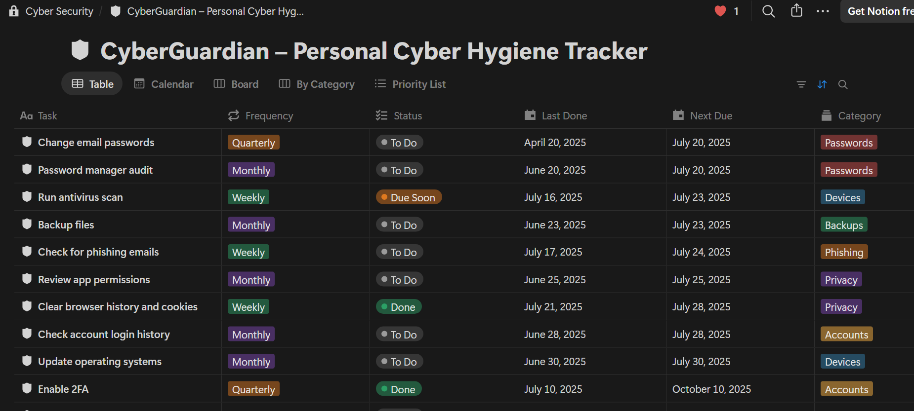

# CyberGuardian – Personal Cyber Hygiene Tracker

## Usage

1. Download Notion:
   ```
   https://www.notion.com/desktop
   ```
2. Notion Template Structure (JSON Outline)
   ```
   Copy the .json file
   paste in the chat prompt inside the Home page.
   ```
   
3. How to Use
- Enter a task’s Last Done date when you complete it—Next Due and Status update automatically.
- As tasks approach their due date, they move to Due Soon and can trigger Notion reminders.
- Use the Board view to see at‑a‑glance what’s pending or missed.
- Run the Weekly Review each week to reflect and record your Cyber Hygiene Score.
- Use the Breach Check Log whenever you manually check your accounts.

## Contributing

1. Fork the repository.
2. Create a new branch for your feature or bug fix.
3. Make your changes and commit them.
4. Push your branch to your forked repository.
5. Submit a pull request to the main repository.

## License

This project is licensed under the [MIT License](LICENSE).

## Output

